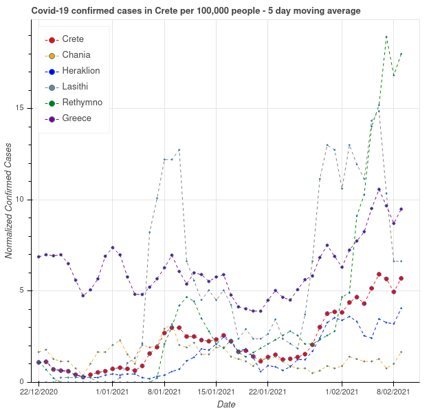

# Track Covid-19 in Crete

## Source code for Covid-19 plots for Crete, Chania province and Greece

https://www.kissamosnews.com/covid-19-confirmed-cases-in-crete-and-chania/
- Absolute number of confirmed cases
- 5 day average of confirmed cases per 100,000 people

https://www.kissamosnews.com/covid-19-vaccinations-in-crete-and-chania/
- Absolute number of vaccinated people
- Percentage of vaccinated population

### Example plot for all regions of Crete: 5 day average of confirmed Covid-19 cases per 100,000 people

Data sources:

https://eody.gov.gr/

https://www.covid19response.gr/index_en.html

